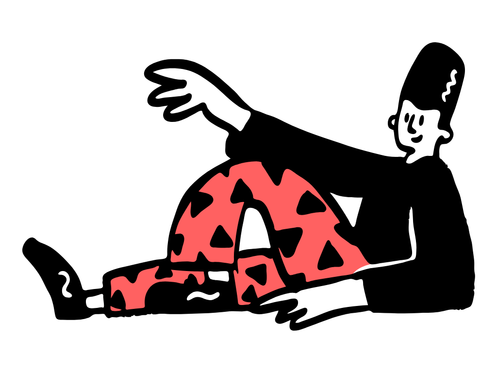
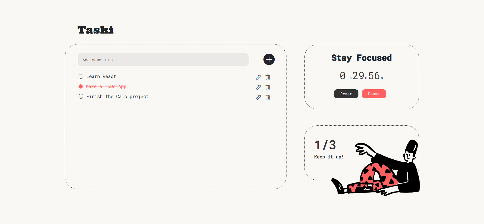

    
    <h2 align="center"><b>TASKI - React based Todo Application</b></h2>
       
    

         <a  href="https://yvm00.github.io/todo-app-react/">click here to see demo</a>
    

   

# ✨Introduction

**TASKI** is a fully responsive website that can help you increase productivity!
- Make a daily to do list
- Set timer for focusing
- Track how many tasks you finished

# ✏️Features
With **TASKI** you can create, edit and delete your daily tasks. It also offers a timer to help you stay focused on your plans and a completed todo tracker to calculate your achievements. The simple interface of the app makes **TASKI** very easy to use. 

# 💻Technology Stack

